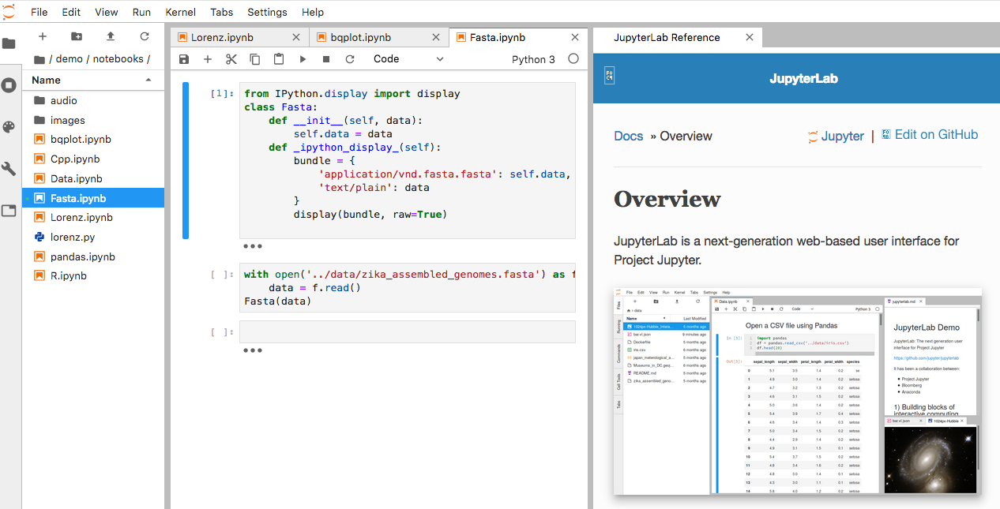

# Unidad 2: Documentación de scripts y cuadernos de apuntes Markdown


## Antecednetes: la crisis de la reproducibilidad 

Que dos personas hagan el mismo experimiento y obtengan el mismo resultado es parte del corazón mismo de la ciencia.

Hacer **investigación reproducible** es poder repetir y obtener los mismos resultados de un trabajo científico. Sin embargo, hoy nos enfrentamos a una ***crisis de la reproducibilidad**.

Vamos a ver [qué se ha publicado al respecto](https://scholar.google.com/scholar?q=reproducibility%20crisis&btnG=Search&as_sdt=800000000001&as_sdtp=on).

[The science ‘reproducibility crisis’ – and what can be done about it, The Conversation 2017](https://theconversation.com/the-science-reproducibility-crisis-and-what-can-be-done-about-it-74198) es un buena síntesis comentada de la situación. En resumen, en cuanto la comunidad científica de diferentes áreas nos sentamos a intentar repetir experimentos y análisis publicados, descrubrimos que los resultados no son reproducibles. Una [encuesta en Nature](https://www.nature.com/polopoly_fs/1.19970.1469695948!/menu/main/topColumns/topLeftColumn/pdf/533452a.pdf?origin=ppub) encontró que 52% de lxs investigadorxs creen que hay una crisis significativa de reproducibilidad, y 32% que hay una crisis menor.  


Esto no sólo es una pérdida de esfuerzo de investigación y dinero, sino que puede llevar a "perseguir" explicaaciones erroneas e incluso desarrolar tratamientos médicos que no funcionan. Por ejemplo el [Reproducibility Project: Cancer Biology](https://elifesciences.org/collections/9b1e83d1/reproducibility-project-cancer-biology) ha encontrado que artículos claves para el desarrollo de nuevos tratamientos vs cáncer no son reproducibles.


**Lo que las revistas dicen al respecto**

**Fragmentos de [Berg (2018) Progress on reproducibility *Science*](http://science.sciencemag.org/content/359/6371/9.full).**

(**negritas mías**)

_A framework has been developed to promote transparency and openness in scientific publications—the [Transparency and Openness Promotion (TOP) guidelines](http://science.sciencemag.org/content/348/6242/1422.full) [...]
**The editors at Science have adjusted practices based on these policies** and have gained experience with many of these issues. We fully support the principles behind these guidelines, including the centrality and benefits of transparency, as captured in our editorial principle that “all data and materials necessary to understand, assess, and extend the conclusions of the manuscript must be available to any reader”_

[...]

_**Over the past year, we have retracted three papers previously published in Science. The circumstances of these retractions highlight some of the challenges connected to reproducibility policies**. In one case, the authors failed to comply with an agreement to post the data underlying their study. Subsequent investigations concluded that one of the authors did not conduct the experiments as described and fabricated data. Here, the lack of compliance with the data-posting policy was associated with a much deeper issue and highlights one of the benefits of policies regarding data transparency. In a second case, some of the authors of a paper requested retraction after they could not reproduce the previously published results. Because all authors of the original paper did not agree with this conclusion, they decided to attempt additional experiments to try to resolve the issues. These reproducibility experiments did not conclusively confirm the original results, and the editors agreed that the paper should be retracted. This case again reveals some of the subtlety associated with reproducibility. In the final case, the authors retracted a paper over extensive and incompletely described variations in image processing. This emphasizes the importance of accurately presented primary data._


**Fragmentos del [Author Guidelines de Molecular Ecology](http://onlinelibrary.wiley.com/journal/10.1111/(ISSN)1365-294X/homepage/ForAuthors.html)**


*Data Storage and Documentation*

*Archiving of data in a publicly accessible repository is mandatory for publication in Molecular Ecology.*

[...] 

*Molecular Ecology requires authors to archive the data supporting their results and conclusions along with sufficient details so that a third party can interpret them correctly. Papers with exemplary data and code archiving are more valuable for future research, and, all else being equal, will be given higher priority for publication.*

_Good practices:_

* _Data should be archived in an appropriate public archive, such as GenBank, Gene Expression Omnibus, TreeBASE, Dryad, FigShare, the Knowledge Network for Biocomplexity, your own institutional or funder repository, or as Supporting Information on the Molecular Ecology web site._
*    _The utility of archived data is greatly enhanced when the scripts and input files used in the analyses are also made available._
*    _Given that scripts may be a mix of proprietary and freely available code, their deposition is not compulsory, but we nonetheless strongly encourage authors to make these scripts available whenever possible._
*    _Software and documentation may be made accessible from a long-term server (e.g., github), however, at least a snapshot of these resources must be posted on Dryad, CRAN (or similar academic/publishing archiving sites) with a link to a long-term server where software development and future releases can be found such that continued access to these resources is ensured._ 

### Reproducibilidad en bioinformática 

* Datos genéticos: 
    * Big Data
    * Mucha información, y creciendo
    * Requieren procesamiento intermedio de datos crudos a los datos en las figuras.
* Análisis de datos genéticos requieren forzosamente bioinformática y/o biología computacional. 
* Por lo tanto:
   - Depeden de software especializado 
   - Sus resultados pueden varias dependiendo de las (muchas) opciones y parámetros utilizados
   - La descripción en "Métodos" no basta para poder repetir el análisis
* **El código** 
   - Es indispensable para poder **repetir** y **mejorar** los análisis 
   - Puede arrojar errores "silenciosos" que sin embargo afecten significativamente los resultados


 
#### ¿Reproducible para quién?

**1. Quién hizo la investigación, 6 meses (ó 6 días) después**

Evitar:

* ¿Cómo chingaos era esto?
* El archivo bueno es final.xlsx. No, espera, tal vez sea final_elbueo.xlsx. Deja reviso la última fecha de modificación. Hum....
* Ahorita me acuerdo.

Ganar:

* Volver a correr fácilmente los mismos datos con pequeñas modificaciones a los parámetros o datos input.
* Reutilizar código o datos para nuevos análisis
* Confianza en tus resultados

**2. Tus colegas y asesor/a**

No temer decir que sí a:

* ¿Me ayudas a hacer este análisis?
* ¿Puedes repetir esta gráfica agregando este dato nuevo? 

**3. La comunidad científica**

* Corroborar resultados
* Construir sobre lo construido


### ¿Por qué compartir nuestro código?

* Reproducibilidad de la cienica
* Construir sobre lo construído y hacer mejor el código antes. Más en el artículo: 
 [Openness makes software better sooner](http://www.nature.com/news/2003/030623/full/news030623-6.html)

Excusas comunes para no compartir nuestro código:
 
* Me da pena que vean mi código
* No quiero que otros saquen provecho de mi código, me pertenece o a mi institución
* Otros no publican su código ¿por qué yo sí?
* Me da flojera pulir mi código para publicarlo
* Si publico mi código le van a encontrar errores y demandar correcciones o ayuda

Si respondiste sí (o tus colaboradores) a cualquiera de los anteriores checa esta lectura recomendada: [Publish your computer code: it is good enough](http://www.nature.com/news/2010/101013/full/467753a.html) de Nick Barnes.


## Documentación de scripts y del proyecto

**Documentar** permite que otrxs entiendan qué hace cada parte de nuestro código y cómo. Un proyecto bien documentado incluye:

* **Código comentado y organizado en scripts o cuardernos de notas** 

* **README** 


#### README
	* "Leeme".
	* Un archivo de texto (no Word, pero puede ser MarkDown) que detalla:
   * **Qué hay** dentro del repositorio (y cada uno de sus directorios).
   * **Qué hacen** cada una de las funciones/scripts del repositorio
   * **Cómo y en qué órden** deben ocuparse los scripts para realizar los análisis
* Ejemplo:
    * [Este](http://datadryad.org/resource/doi:10.5061/dryad.n3jk5) repositorio de datos está dividido en varias secciones. La 3ra se ve así:


Y si abres el README.mdown verás algo así (los colores y el fondo negro son porque lo abrí con el editor MacDown, pero es un vil archivo de texto):

 


## Markdown

Markdown es el formato en el que está escrito este repositorio y el que ocupan sitios como Github, Stacksoverflow y muchos tutoriales, además también es la base para escribir en **Rmarkdown**, **R Note books** y los **Notebooks de Jupyter** 

Básicamente es una manera de escribir texto de manera que sea interpretado por un programa y convertido en un bonito archivo html. Tiene la ventaja de que está especialmente hecho para poder `formatear código en un texto como este`.

[Aquí una guía de MarkDown](https://github.com/adam-p/markdown-here/wiki/Markdown-Cheatsheet)

Es útil aprender la sintaxis de Markdown para poder documentar mejor tus proyectos, sobretodo si los subes a GitHub.


### Rmarkdown y R Notebook

[R Markdown](http://rmarkdown.rstudio.com/index.html) es un formato que te permite crear documentos o reportes, en los que al mismo tiempo guardas y ejecutas código.


Primero, instala R Markdown (en nuestro contenedor ya está instalado, no es necesario hacerlo de nuevo):

```
 install.packages("rmarkdown")
```

Ahora puedes crear un archivo `.Rmd` en "Archivo > Nuevo archivo > R Markdown". (nota que estoy es distinto que R script).

Un archivo R Markdown es un archivo de texto plano que debe verse algo así:


El archivo tiene tres tipos de contenido:

- Encabezado (---)
- Código (```)
- Texto simple (Markdown)


Notarás que se pueden ejecutar las líneas de código de forma independiente e interactiva, y que el output (lo que saldría en la consola o los plots) del código de muestra debajo de éste.


Cuando abres o creas un archivo Rmd la interfaz de RStudio cambia. Ahora, puedes ejecutar el código usando las flechas y los resultados se despliegan a continuación del código.

Abre por ejemplo el archivo [Graficar_en_R.Rmd](../../Unidad1/R/Graficar_en_R.Rmd), que es el que utilicé para realizar las notas de esa clase. Fíjate en lo que dicen algunos chunks ¿qué crees que haga `echo=FALSE`?


**Archivos de salida**

A partir de un archivo .Rmd, es posible crear archivos de salida en una gran variedad de formatos, por ejemplo:

- HTML
- Documentos interactivos
- Word
- Diapositivas
- PDF
- Páginas web
- R Notebooks

Checa más formatos de salida [aquí](http://rmarkdown.rstudio.com/formats.html)

Para crear el reporte o archivo de salida, debes correr `render()`, dar click en "Knit" o ⇧+Ctrl+K.

Cuando se renderea un archivo .Rmd, también se crea un archivo html. Este es un archivo HTML que contiene el código y los output resultantes, que puede abrirse en cualquier explorador web y en RStudio.


#### Generar un reporte de un script .R

Es posible generar un reporte a partir de un script de R, aún cuando **no tenga el formato de un archivo R Markdown**. Únicamente das click en el cuaderno (Compile report) o Ctrl+Shift+K.

Prueba hacer lo anterior con el archivo [1.IBR_testing.r](../../Unidad1/R/Prac_R/mantel/1.IBR_testing.r) que vimos antes.


#### ¿Rmd o reporte de script.R?

Un Rmarkdown es más útil si quieres hacer un reporte de los análisis, o incluso escribir tu tesis, utilizando R, de forma que tanto el texto explicativo como el código estén integrados en el mismo archivo. Esto garantiza la reproducibilidad total, pero solo funciona si todo lo vas a hacer con R y si te acomoda que otros comenten tu documento así.

Un reporte de un script.R funciona si quieres "guardar cómo se ve" correr un análisis o discutirlo con tus colegas, pero no son un reporte tan bonito para entregar a alguien externo. 

Así que cuándo usar cuál depende de la situación y tus gustos.


## Jupyter notebooks y JupyterLab

### Notebooks

Los notebooks de Jupyter son parecidos a los Rmd. Tienen celdas dedicadas al código y otras al texto en formato md. Originalmente fueron creados para Julia, python y R. De hecho de ahí viene el nombre, pero pueden también integrarse otros kernel, como C++ o Ruby.

El notebook incluye el notebook por sí mismo, una terminal, editor de texto, entre otros.

Los notebooks son un archivo `*.ipynb`, mismo que puede abrirse con Jupyter de forma interactiva o exportarse a html, pdf, etc.

La mejor forma de aprender Jupyter es usarlo directamente. Buenas noticias ¡no hay que instalar nada! puedes correrlo aquí:

[https://jupyter.org/try](https://jupyter.org/try).


### JupyterLab

JupyterLab es la nueva interfaz (2018) de Jupyter, permite incorporar los notebooks con más herramientas.

Así se ve:



**Ejercicio**. Entra a [https://jupyter.org/try](https://jupyter.org/try), abre un JupyterLab y le la documentación.


